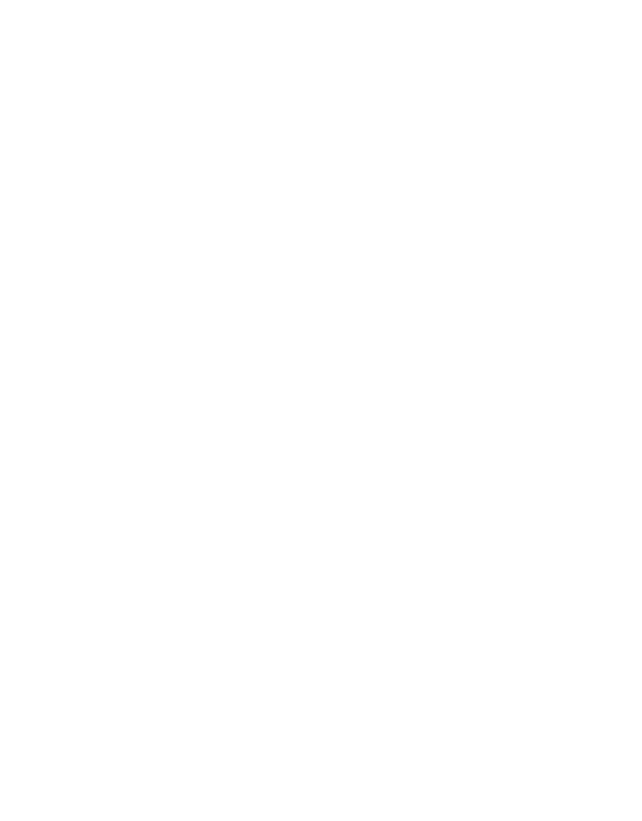

{width=200 .center}

## Introdução à Documentação de Dados da Mutuca

Boas vindas ao pojeto Mutuca! Estamos muito satisfeitos por compartilhar com você o nosso interesse
em dados, tecnologia e, principalmente, transparência pública.

Antes de tudo, a Mutuca é um motor de coleta e ingestão de dodos. Nos esforçamos para coletar,
transformar e disponibilizar dados para futura análises e apurações a respeito das informações
públicas dos municípios do interiror Nordestino. Nosso objetivo maior é tornar esses dados
acessíveis a todos os cidadãos, garantindo que possam ser explorados de maneira prática e
compreensível. Embora muitos desses dados já estejam disponíveis em portais oficiais, como o Portal
da Transparência, eles frequentemente se encontram em formatos difíceis de manipular ou analisar
diretamente, o que limita o poder de fiscalização e o exercício pleno da cidadania. É aí que entra a
Mutuca.

Mas nosso compromisso vai além de fornecer dados. Acreditamos que, ao democratizar a informação e
torná-la compreensível, ajudamos a criar um ambiente onde os cidadãos tenham participação ativa nas
decisões do governo local, que possam questionar processos e contribuir para uma governança mais
eficiente e justa. Um compromisso totalmente alienhado aos princípios e às leis de transparência
pública, uma vez que tanto a
**[Lei Complementar nº 131/2009](https://www.planalto.gov.br/ccivil_03/leis/lcp/lcp131.htm)** quanto
a
[**Lei de Acesso à Informação (Lei 12.527/2011)**](https://www.planalto.gov.br/ccivil_03/_ato2011-2014/2011/lei/l12527.htm)
determinam que os órgãos públicos devem disponibilizar informações sobre a execução orçamentária e
financeira de forma acessível e em tempo real. Contudo, a realidade, especialmente em municípios do
interior do país, é que os dados frequentemente estão fragmentados, despadronizados e, muitas vezes,
agregados, dificultando uma análise detalhada por parte da população.

Por isso, o projeto Mutuca é inteiramente open source. Todo o nosso código, documentação e
metodologias estão disponíveis publicamente para que qualquer pessoa possa estudar, reutilizar,
adaptar ou contribuir. Queremos fomentar uma rede colaborativa de desenvolvedores, jornalistas,
pesquisadores e cidadãos comprometidos com a transparência e o fortalecimento da democracia. Ao
abrir nossas portas para a colaboração, acreditamos que podemos ir mais longe — com mais olhos nos
dados, mais mãos no código e mais vozes construindo uma sociedade informada e vigilante.

## Como usar essa documentação

Esta documentação foi elaborada para orientar o uso, a manutenção e a colaboração com o projeto
**Mutuca**, seguindo boas práticas adotadas em projetos de engenharia de dados.

Você pode utilizá-la como um guia técnico e conceitual para compreender os seguintes pontos:

### 📚 Estrutura da documentação

A documentação está organizada por seções específicas, de modo a facilitar a navegação e a
reutilização do conteúdo:

| Seção                              | Descrição                                                                                                                                     |
| ---------------------------------- | --------------------------------------------------------------------------------------------------------------------------------------------- |
| **Visão Geral**                    | Introdução ao projeto, seus objetivos, escopo e princípios.                                                                                   |
| **Referências Legais**             | Leis e normativas que fundamentam o projeto, como a LAI e a LCP 131/2009.                                                                     |
| **Recomendações de Boas Práticas** | Convenções de codificação, versionamento, documentação e logs.                                                                                |
| **Pipelines de Coleta**            | Explicação sobre os scripts de coleta automatizada: fontes públicas utilizadas, formatos dos dados, métodos de raspagem e atualização.        |
| **Orquestração e Agendamento**     | (Quando aplicável) Uso de ferramentas como Apache Airflow, cron ou serviços externos para automatizar as tarefas.                             |
| **Modelos de Dados**               | Dicionários de dados, esquemas das tabelas, relacionamentos, padrões de nomenclatura e regras de transformação aplicadas.                     |
| **FAQ / Dúvidas Frequentes**       | Respostas a perguntas recorrentes para facilitar o onboarding.                                                                                |
| **Execução Local**                 | Passos para instalar o ambiente, rodar os pipelines localmente e configurar variáveis de ambiente.                                            |
| **Contribuições**                  | Como contribuir com código, documentação ou ideias. Contém o fluxo de pull requests e revisão.                                                |
| **Arquitetura de Dados**           | Detalhamento das camadas de ingestão, processamento e disponibilização dos dados. Inclui diagramas, tecnologias utilizadas e fluxos de dados. |

### 🛤 Recomendações de leitura

Se você é:

- **Usuário final / cidadão, comece por**:
  [Introdução ao projeto Mutuca](overview/introducao_projeto.md#introducao-ao-projeto-mutuca),
  [Modelos de Dados](modelos/datamodel.md#modelo-de-dados) e
  [Tutoriais](tutoriais/index.md#itrodução-aos-tutoriais).
- **Desenvolvedor, acesse:** [Desenvolvimento Local](desenvolvimento/index.md),
  [Pipelines de Coleta](pipelines/index.md), [Boas Práticas](boas_praticas/index.md) e
  [Contribuições](contribuicoes/guia.md).
- **Analista de dados / jornalista, foque em:** [Modelos de Dados](modelos/datamodel.md) e
  [Arquitetura de Dados](arquitetura/visao_arquitetural.md).
- **Gestor público / pesquisador consulte a seção:** [Referências Legais](referencias/leis.md) e os
  resultados disponibilizados.

### 🔍 Navegação e pesquisa

A documentação pode ser navegada diretamente pelos links no índice ou pesquisada por palavras-chave
usando `Ctrl+F` (ou `Cmd+F` no macOS).

---

Esta documentação está em constante evolução. Contribuições são bem-vindas! 🙌
